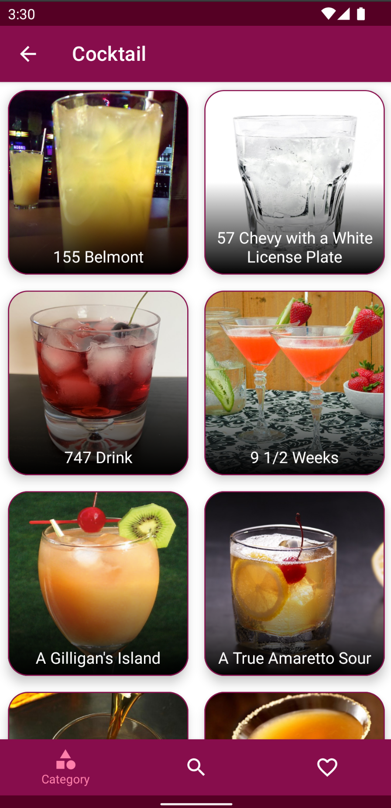
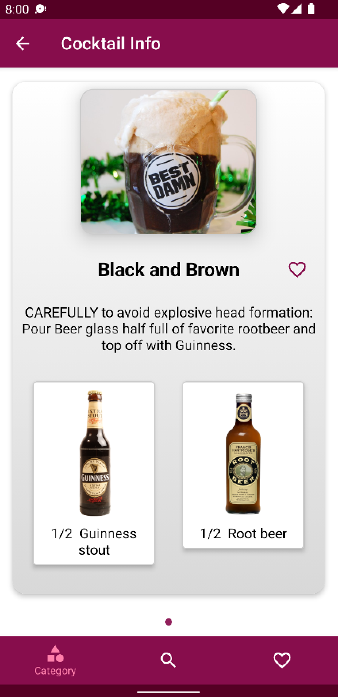
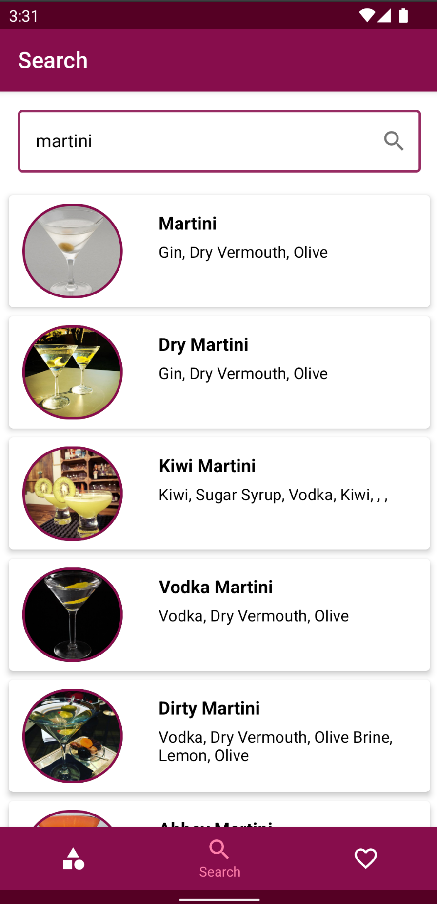
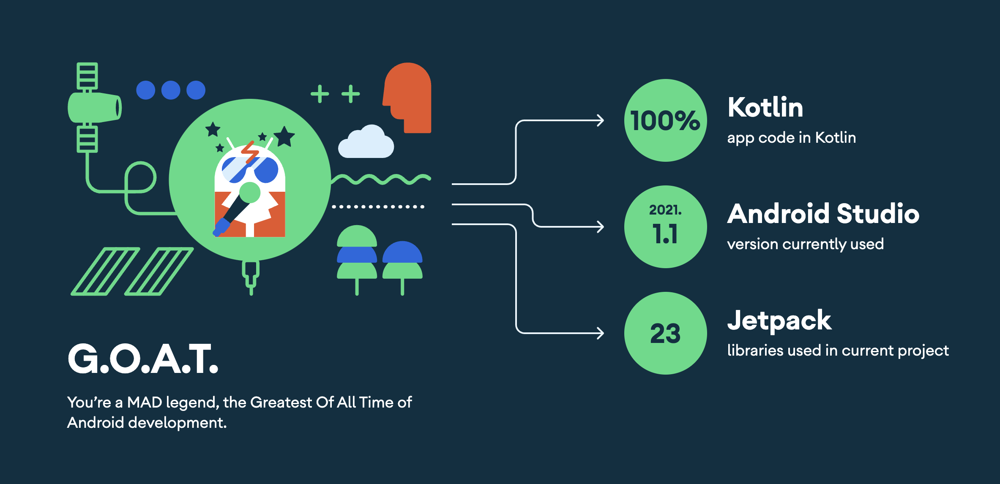

# Cocktail Recipe App

Cocktail Recipe App is an Application based on Modern Android tecth-stacks especially focus on Jetpack Compose UI. Fetching data from network and store favorite cocktail in database.

&nbsp;&nbsp;&nbsp;&nbsp;


## Tech stack & Libraries

- [Kotlin](https://developer.android.com/kotlin) based, [Kotlin Flow](https://developer.android.com/kotlin/flow) + [Kotlin Coroutines](https://github.com/Kotlin/kotlinx.coroutines) for asynchronous.
- [Material Components](https://github.com/material-components/material-components-android) - Material design library.
- [Dagger Hilt](https://dagger.dev/hilt/) - Dependency injection library.
- [Android Jetpack](https://developer.android.com/jetpack)
  - [Navigation Compose](https://developer.android.com/jetpack/compose/navigation) - Navigate between composables. 
  - [ViewModel](https://developer.android.com/topic/libraries/architecture/viewmodel) - Stores UI-related data that is lifecycle aware (didn't destroyed on UI changes).
  - [Room](https://developer.android.com/training/data-storage/room) - ORM which wraps android's native SQLite database.
- [Coil](https://github.com/coil-kt/coil) - Load images from network.
- [Retrofit](https://square.github.io/retrofit/) & [OkHttp3](https://square.github.io/okhttp/) - Construct REST APIs.
- [Kotlinx Serialization](https://github.com/Kotlin/kotlinx.serialization) - Kotlin serialize, deserialize library.
- [Accompanist](https://google.github.io/accompanist/insets/)
  - [System UI Controller](https://google.github.io/accompanist/systemuicontroller/) - To control system UI in composable.
  - [Pager](https://google.github.io/accompanist/pager/) - Paging layouts for Jetpack Compose.
  - [Placeholder](https://google.github.io/accompanist/placeholder/) - Modifier for display 'placeholder' UI while content is loading.
- [Platte](https://developer.android.com/training/material/palette-colors) - To get prominent colors from images.
- [Android Architecture Components](https://developer.android.com/topic/architecture)
  - MVVM Architecture (Declarative UI - ViewModel - Use Case - Model)
  - Repository pattern

## MAD Score



## Open API

Cocktail Recipe App using the [TheCocktailDB](https://www.thecocktaildb.com) for construct RESTful API.
This DB provides API related drinks and cocktails from around the world.

## License

```
MIT License

Copyright (c) 2022 beomsu317

Permission is hereby granted, free of charge, to any person obtaining a copy
of this software and associated documentation files (the "Software"), to deal
in the Software without restriction, including without limitation the rights
to use, copy, modify, merge, publish, distribute, sublicense, and/or sell
copies of the Software, and to permit persons to whom the Software is
furnished to do so, subject to the following conditions:

The above copyright notice and this permission notice shall be included in all
copies or substantial portions of the Software.

THE SOFTWARE IS PROVIDED "AS IS", WITHOUT WARRANTY OF ANY KIND, EXPRESS OR
IMPLIED, INCLUDING BUT NOT LIMITED TO THE WARRANTIES OF MERCHANTABILITY,
FITNESS FOR A PARTICULAR PURPOSE AND NONINFRINGEMENT. IN NO EVENT SHALL THE
AUTHORS OR COPYRIGHT HOLDERS BE LIABLE FOR ANY CLAIM, DAMAGES OR OTHER
LIABILITY, WHETHER IN AN ACTION OF CONTRACT, TORT OR OTHERWISE, ARISING FROM,
OUT OF OR IN CONNECTION WITH THE SOFTWARE OR THE USE OR OTHER DEALINGS IN THE
SOFTWARE.
```
